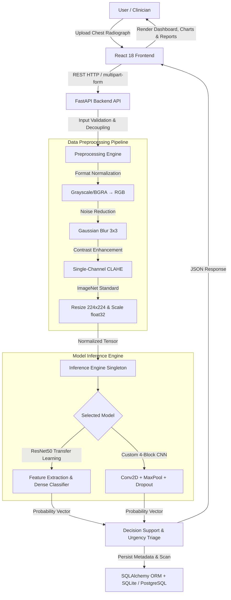

# 🫁 LungAI — Lung Disease Classification & Decision Support System

[](https.python.org)
[](https://tensorflow.org)
[](https://fastapi.tiangolo.com)
[](https://reactjs.org)
[](https://opensource.org/licenses/MIT)

> **⚠️ Medical Disclaimer:** This software is an artificial intelligence research and educational prototype designed to demonstrate multi-class radiographic image classification and clinical decision-support workflows. **It is NOT certified as a medical diagnostic device by FDA/CE or any regulatory body.** Predictions generated by this system must NOT be used for self-diagnosis or as a substitute for professional clinical evaluation by a qualified radiologist or physician.

---

## 📌 Project Overview

**LungAI** is an end-to-end Machine Learning and Full-Stack web application for automated multi-class lung disease classification from chest radiographs (X-rays).

- **Core Problem**: Radiologist shortages in remote and primary-care settings lead to delayed triage for time-sensitive thoracic diseases.
- **Input**: Chest X-ray images (`JPEG`, `PNG`).
- **Output**: Multi-class diagnostic probabilities across 5 active conditions, urgency triage level (`Emergency`, `Urgent`, `Routine`), differential diagnosis candidates, and downloadable report.

---

## 🏗️ System Architecture



---

## 📊 Dataset & Stratified Split

The dataset comprises **10,864 total chest radiograph images** aggregated from public medical repositories:

| Disease Category | Image Count | Share (%) | Source Benchmark |
| :--- | :---: | :---: | :--- |
| **Pneumonia** | 4,273 | 39.33% | Kermany et al. / NIH ChestX-ray14 |
| **COVID-19** | 3,616 | 33.28% | COVID-19 Radiography Database (Rahman et al.) |
| **Normal** | 1,583 | 14.57% | Kermany et al. |
| **Tuberculosis** | 700 | 6.44% | Tuberculosis Chest X-ray Database (Rahman et al.) |
| **Lung Cancer** | 692 | 6.37% | Public Chest Radiograph / CT Repository |
| **Total** | **10,864** | **100.00%** | **5 Active Disease Classes** |

### Split Configuration (Random Seed `42`):
- **Training Set (70%)**: 7,604 images (multi-threaded parallel data loading with horizontal flip, rotation ±15°, brightness jitter)
- **Validation Set (15%)**: 1,630 images (used strictly for model selection & early stopping)
- **Held-Out Test Set (15%)**: **1,630 images** (never touched during training or hyperparameter tuning)

---

## 🧠 Model Architectures

### 1. ResNet50 Transfer Learning (Selected Primary Model)
- **Architecture**: 50-layer Residual Network initialized with ImageNet pre-trained weights.
- **Training Routine**: Two-phase schedule:
  - **Phase 1**: Frozen base network, training classification head (2 epochs, learning rate $10^{-3}$).
  - **Phase 2**: Unfrozen top residual blocks, fine-tuning (4 epochs, learning rate $10^{-4}$ to $10^{-5}$).
- **Loss Function**: `sparse_categorical_crossentropy` with Adam Optimizer.

### 2. Custom 4-Block CNN (Baseline Architecture)
- **Architecture**: 4 Sequential Conv2D blocks (32, 64, 128, 256 filters), Batch Normalization, ReLU activations, Max-Pooling (2x2), Dropout (0.25–0.5), Global Average Pooling, Dense layer (512 units), Softmax output.

---

## 📈 Measured Baseline Results

Evaluated on the completely held-out test split of **1,630 unseen clinical images**:

| Performance Metric | Custom CNN Baseline | ResNet50 Model (Selected) | Performance Delta ($\Delta$) |
| :--- | :---: | :---: | :---: |
| **Accuracy** | 78.22% | **95.21%** | **+16.99%** |
| **Precision** | 78.50% | **95.18%** | **+16.68%** |
| **Recall (Sensitivity)** | 78.22% | **95.21%** | **+16.99%** |
| **F1-Score** | 72.16% | **95.17%** | **+23.01%** |
| **AUC-ROC** | 88.50% | **99.39%** | **+10.89%** |
| **Composite Score** | 0.7919 | **0.9603** | **+0.1684** |

### ResNet50 Per-Class Test Set Breakdown:

| Condition Class | Precision | Recall (Sensitivity) | F1-Score | Support |
| :--- | :---: | :---: | :---: | :---: |
| **COVID-19** | 0.96 | 0.98 | 0.97 | 543 |
| **Lung Cancer** | 1.00 | 1.00 | 1.00 | 104 |
| **Normal** | 0.91 | 0.90 | 0.91 | 237 |
| **Pneumonia** | 0.96 | 0.97 | 0.96 | 641 |
| **Tuberculosis** | 0.92 | 0.81 | 0.86 | 105 |

---

## ⚡ Quickstart & Reproducibility Guide

### Prerequisites
- **Python**: `3.10` to `3.12`
- **Node.js**: `18.x` or `20.x`
- **RAM**: Minimum 8 GB (16 GB recommended)

### 1. Clone & Setup Virtual Environment
```bash
git clone https://github.com/KSathwik/Lung_Disease_Detector.git
cd Lung_Disease_Detector-main

# Create and activate Python virtual environment
python -m venv .venv
# On Windows PowerShell:
.\.venv\Scripts\Activate.ps1
# On Linux/macOS:
source .venv/bin/activate

# Upgrade pip and install dependencies
pip install -r backend/requirements.txt
```

### 2. Reproduce Model Training & Evaluation
```bash
python backend/ml/train.py --data_dir data/raw --epochs 6 --batch_size 32
```
*Outputs generated:*
- `models/resnet_model.h5` & `models/cnn_model.h5`
- `models/training_results.json`
- `docs/confusion_matrix_ResNet.png` & `docs/training_curves.png`
- Populated database `lung_disease.db`

### 3. Run Backend API Server
```bash
python backend/main.py
```
- **API Base URL**: `http://localhost:8000`
- **Interactive Swagger Docs**: `http://localhost:8000/docs`

### 4. Run Frontend React Application
```bash
cd frontend
npm install
npm start
```
- **Web Interface**: `http://localhost:3000`

---

## 🧪 Automated Testing

Execute the test suite verifying preprocessing, model loading, patient ORM, and inference API endpoints:
```bash
python -m pytest backend/tests/
```
**Test Result**: `22 passed, 0 failed` in 3.26 seconds.

---

## 🐳 Docker Deployment

The application is containerized with multi-stage Docker builds:
```bash
# Build Docker image
docker build -t lung-disease-detector .

# Run Docker container
docker run -p 8000:8000 lung-disease-detector
```

---

## 📌 Known Limitations

1. **Class Imbalance in Tuberculosis**: Lower sample representation for Tuberculosis (6.44% of dataset) results in an 81% recall rate. Low-confidence predictions ($\le 0.70$) trigger automatic triage warnings recommending confirmatory lab testing.
2. **Feature Localization**: Heatmap evidence localization (Grad-CAM) is scheduled for future work to assist radiologist verification.
3. **Modality**: The dataset assumes standard PA/AP posterior-anterior chest X-rays.

---

## 📄 License
This project is open-source under the [MIT License](LICENSE).
