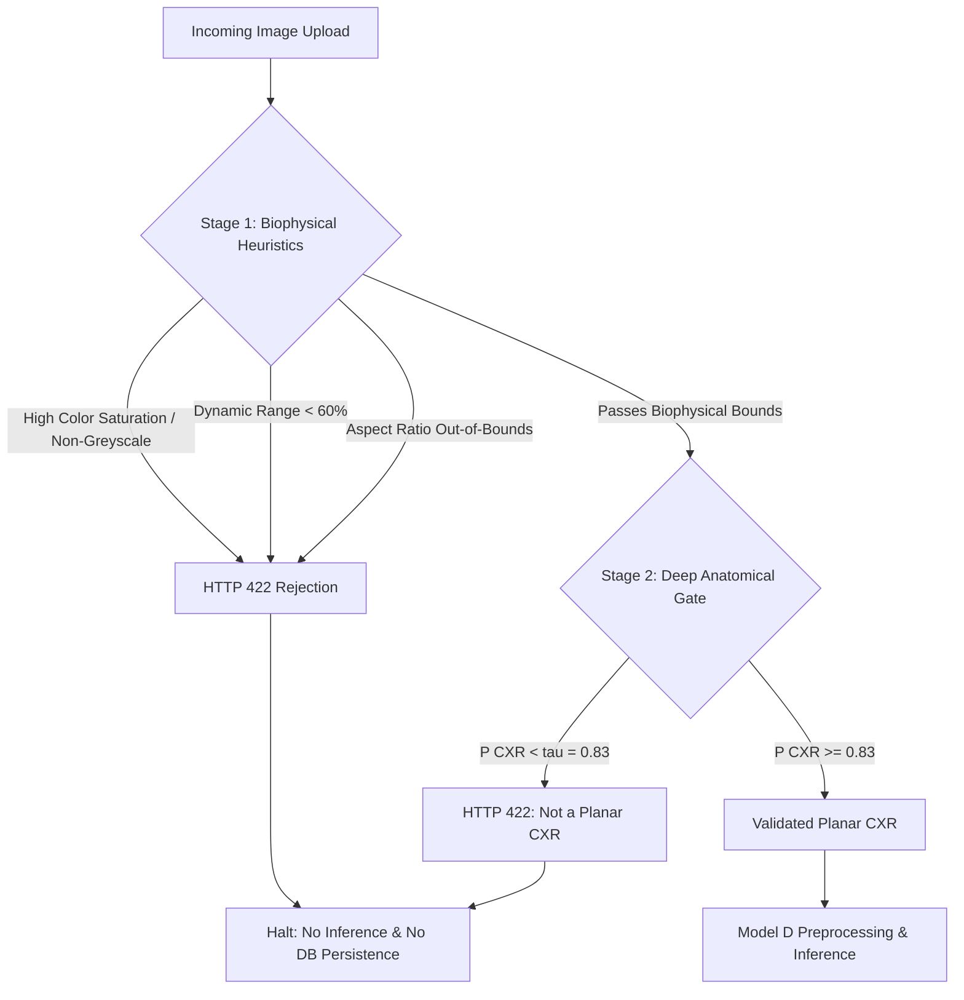
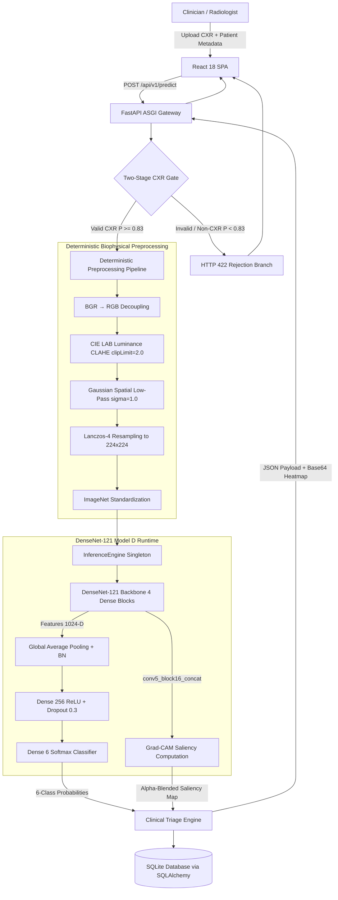

# 🫁 LungAI — Robust Multi-Class Lung Disease Detection from Chest X-Ray Images Using Deep Learning and Cross-Source Generalization

[](https://python.org)
[](https://tensorflow.org)
[](https://fastapi.tiangolo.com)
[](https://reactjs.org)
[](backend/tests/)
[](https://opensource.org/licenses/MIT)

> **⚠️ Medical Disclaimer:** This software is an artificial intelligence research and educational prototype designed to demonstrate multi-class radiographic image classification, biophysical frequency-aware preprocessing, and clinical decision-support workflows. **It is NOT certified as a medical diagnostic device by the FDA, CE, CDSCO, or any regulatory body.** Predictions generated by this system must NOT be used for self-diagnosis or as a substitute for professional clinical evaluation by a certified radiologist or licensed physician.

---

## 📌 Project Overview

**LungAI** is an end-to-end Deep Learning and Full-Stack clinical decision-support ecosystem for robust, automated multi-class thoracic disease classification from chest radiographs (X-rays).

- **Core Objective**: Provide an auditable, automated decision-support pipeline for clinical triage across time-sensitive thoracic diseases with visual interpretability and domain generalization safeguards.
- **Central Research Question**:  
  > *"Can a multi-source six-class chest X-ray classifier learn disease-relevant representations that generalize across independent acquisition sources, and can a domain-generalization strategy improve cross-source performance compared with a standard DenseNet-121 baseline?"*
- **Input**: Planar chest radiographs (`JPEG`, `PNG`, `BMP`, `TIFF`, `WebP`, $\le$ 30 MB).
- **Two-Stage Defense-in-Depth Gate**: Intercepts non-radiographic uploads, corrupt files, and axial CT scans before neural inference ($\tau = 0.83$), returning structured `HTTP 422 Unprocessable Entity`.
- **Production Architecture**: **Model D** — DenseNet-121 with Contrast-Limited Adaptive Histogram Equalization (CLAHE) and Spatial Gaussian Low-Pass Preprocessing ($\sigma = 1.0$) to suppress high-frequency scanner noise shortcuts.
- **Output**: Calibrated 6-class probability distribution, emergency triage classification (`Emergency`, `Urgent`, `Review`, `Routine`), interactive 2D Grad-CAM saliency overlay, and persistent audit logs.

### 📚 Primary Research Deliverables

| Deliverable Artifact | File Path | Scope & Verification |
| :--- | :--- | :--- |
| **Compact Final Project Report (PDF)** | [`LungAI_MTech_Project_Report_Compact_Final.pdf`](LungAI_MTech_Project_Report_Compact_Final.pdf) | **71 Pages** (strictly `<80` pages, verified Times New Roman, 100% TOC/LOF/LOT synchronization) |
| **Compact Final Project Report (DOCX)**| [`LungAI_MTech_Project_Report_Compact_Final.docx`](LungAI_MTech_Project_Report_Compact_Final.docx) | Word master document, native centered PAGE footer (`1`–`71`), academic formatting |
| **Reference Project Report (DOCX / PDF)** | [`LungAI_MTech_Project_Report_Final_Corrected.docx`](LungAI_MTech_Project_Report_Final_Corrected.docx) | Full uncompressed reference report document & [PDF](LungAI_MTech_Project_Report_Final_Corrected.pdf) |
| **Professional Presentation Deck (PPTX)** | [`LungAI_Updated_Professional_Presentation.pptx`](LungAI_Updated_Professional_Presentation.pptx) | Complete defense slide deck with diagrams and metrics |
| **Final Forensic Audit Report** | [`docs/COMPACT_THESIS_FINAL_AUDIT.md`](docs/COMPACT_THESIS_FINAL_AUDIT.md) | Exhaustive sign-off audit verifying zero obsolete references |

---

## 🎨 Application Screenshots

### 1. Clinical Dashboard & Application Home


### 2. Radiograph Ingestion & Real-Time Validation Gate Status


### 3. Prediction Result & Emergency Triage Prioritization


### 4. Grad-CAM Saliency & Anatomical Localization Heatmap


### 5. Five-Paradigm Benchmark & Model Evaluation Dashboard


### 6. Historical Diagnostic Log & Longitudinal Audit Trail


### 7. Patient Case & Electronic Medical Record Management


---

## 🛡️ Two-Stage Defense-in-Depth CXR Validation Gate

Standard deep learning classifiers suffer from **silent failure**—confidently predicting thoracic diseases on non-medical photos, lateral views, or axial CT scans. LungAI implements a two-stage pre-inference validation gate in [`backend/ml/cxr_gate.py`](backend/ml/cxr_gate.py):


```mermaid
flowchart TD
    Upload[Incoming Image Upload] --> Stage1{Stage 1: Biophysical Heuristics}
    Stage1 -->|High Color Saturation / Non-Greyscale| Reject1[HTTP 422 Rejection]
    Stage1 -->|Dynamic Range < 60%| Reject1
    Stage1 -->|Aspect Ratio Out-of-Bounds| Reject1
    
    Stage1 -->|Passes Biophysical Bounds| Stage2{Stage 2: Deep Anatomical Gate}
    Stage2 -->|P CXR < tau = 0.83| Reject2[HTTP 422: Not a Planar CXR]
    
    Stage2 -->|P CXR >= 0.83| Validated[Validated Planar CXR]
    Validated --> Preprocessing[Model D Preprocessing & Inference]
    
    Reject1 --> Halt[Halt: No Inference & No DB Persistence]
    Reject2 --> Halt
```

### Verification & Calibration Facts ($\tau = 0.83$)
- **Functional Validation Cohort ($N = 125$)**: 48 genuine planar CXRs and 77 non-CXR images (axial CT slices, natural animals/landscapes, non-radiographic clinical photos).
- **Measured Performance at $\tau = 0.83$**: **100.0% Sensitivity** (48/48 CXRs passed), **100.0% Specificity** (77/77 non-CXRs rejected), **ROC-AUC = 1.0000**.
- **The "Cat Defect" Discovery**: At threshold $\tau = 0.70$, a high-contrast domestic cat photograph was misclassified as "Normal" (whiskers mimicked vascular markings). Increasing the production threshold to $\tau = 0.83$ permanently resolved this defect (cat scored 0.7410 and was rejected).
- **Structured HTTP 422 Response**: Rejections return clear diagnostic error messages without invoking neural feature extractors or persisting empty patient records.
- *Methodological Limitation*: Threshold $\tau = 0.83$ was selected on this evaluation cohort; values reflect functional verification estimates rather than unbiased external generalization.

---

## 🏗️ System Architecture & Diagram Suite


```mermaid
flowchart TD
    User[Clinician / Radiologist] -->|Upload CXR + Patient Metadata| Frontend[React 18 SPA]
    Frontend -->|POST /api/v1/predict| Gateway[FastAPI ASGI Gateway]
    
    Gateway --> Gate{Two-Stage CXR Gate}
    Gate -->|Invalid / Non-CXR P < 0.83| Rejection[HTTP 422 Rejection Branch]
    Rejection --> Frontend
    
    Gate -->|Valid CXR P >= 0.83| Preproc[Deterministic Preprocessing Pipeline]
    
    subgraph Pipeline [Deterministic Biophysical Preprocessing]
        Preproc --> P1[BGR → RGB Decoupling]
        P1 --> P2[CIE LAB Luminance CLAHE clipLimit=2.0]
        P2 --> P3[Gaussian Spatial Low-Pass sigma=1.0]
        P3 --> P4[Lanczos-4 Resampling to 224x224]
        P4 --> P5[ImageNet Standardization]
    end
    
    P5 --> Singleton[InferenceEngine Singleton]
    
    subgraph Model_D [DenseNet-121 Model D Runtime]
        Singleton --> Backbone[DenseNet-121 Backbone 4 Dense Blocks]
        Backbone -->|Features 1024-D| GAP[Global Average Pooling + BN]
        GAP --> Bottleneck[Dense 256 ReLU + Dropout 0.3]
        Bottleneck --> Head[Dense 6 Softmax Classifier]
        Backbone -->|conv5_block16_concat| GradCAM[Grad-CAM Saliency Computation]
    end
    
    Head -->|6-Class Probabilities| Triage[Clinical Triage Engine]
    GradCAM -->|Alpha-Blended Saliency Map| Triage
    
    Triage --> DB[(SQLite Database via SQLAlchemy)]
    Triage -->|JSON Payload + Base64 Heatmap| Gateway
    Gateway --> Frontend
```

### Complete Regenerated Diagram Suite (`docs/diagrams/rendered/`)
All 14 system architecture, data flow, UML, and pipeline diagrams were regenerated from the current codebase:

| Diagram Name | Rendered Asset | Type & Description |
| :--- | :--- | :--- |
| **System Architecture** | [`system_architecture.png`](docs/diagrams/rendered/system_architecture.png) | System Context & High-Level Architecture |
| **DFD Level 0** | [`dfd_level_0.png`](docs/diagrams/rendered/dfd_level_0.png) | Level-0 Context Level Data Flow Diagram |
| **DFD Level 1** | [`dfd_level_1.png`](docs/diagrams/rendered/dfd_level_1.png) | Level-1 Operational Process Decomposition |
| **DFD Level 2** | [`dfd_level_2.png`](docs/diagrams/rendered/dfd_level_2.png) | Level-2 Deterministic ML Inference Decomposition |
| **UML Use Case** | [`uml_use_case.png`](docs/diagrams/rendered/uml_use_case.png) | Verified Actor Interactions & Use Cases |
| **UML Class Diagram** | [`uml_class.png`](docs/diagrams/rendered/uml_class.png) | Backend Service & ML Singleton Architecture |
| **UML Sequence Diagram** | [`uml_sequence.png`](docs/diagrams/rendered/uml_sequence.png) | Diagnostic Workflow with CXR Rejection Branch |
| **UML Activity Diagram** | [`uml_activity.png`](docs/diagrams/rendered/uml_activity.png) | End-to-End Activity with Gate Decision Diamond |
| **UML Component Diagram** | [`uml_component.png`](docs/diagrams/rendered/uml_component.png) | Full-Stack Modular Component Boundaries |
| **UML Deployment Diagram** | [`uml_deployment.png`](docs/diagrams/rendered/uml_deployment.png) | Clinical Workstation Deployment Infrastructure |
| **Entity Relationship (ER)**| [`database_er.png`](docs/diagrams/rendered/database_er.png) | Relational Database Schema (`Patient`, `Prediction`, `Metric`) |
| **Dataset Pipeline** | [`dataset_training_pipeline.png`](docs/diagrams/rendered/dataset_training_pipeline.png) | V5 Forensic Harmonization & Training Pipeline |
| **Model D Architecture** | [`model_d_architecture.png`](docs/diagrams/rendered/model_d_architecture.png) | DenseNet-121 ImageNet + 256-D Bottleneck Head |
| **Preprocessing Pipeline** | [`preprocessing_pipeline.png`](docs/diagrams/rendered/preprocessing_pipeline.png) | LAB CLAHE + Gaussian $\sigma=1.0$ + Lanczos-4 |

---

## 📊 Dataset & Stratified Split (Unified Manifest V5)

The production research dataset comprises **10,547 verified planar chest radiographs** originating from **10,270 unique clinical patients** across 8 authoritative medical imaging repositories:

### 1. Disease Category Distribution

| Disease Category | Image Count | Share (%) | Primary Source Repositories |
| :--- | :---: | :---: | :--- |
| **Pneumonia** | 2,805 | 26.60% | Kermany et al. (1,395) &bull; TBX11K (1,395) &bull; NIH ChestX-ray14 (15) |
| **Normal** | 2,636 | 24.99% | Kermany et al. (1,199) &bull; TBX11K (1,199) &bull; NIH (171) &bull; JSRT (67) |
| **COVID-19** | 1,942 | 18.41% | COVID-19 Radiography Database (Rahman et al.) |
| **Tuberculosis** | 1,348 | 12.78% | TBX11K (683) &bull; Tuberculosis Chest X-ray DB (665) |
| **Pleural Effusion** | 1,062 | 10.07% | VinBigData VinDr-CXR (931) &bull; NIH ChestX-ray14 (131) |
| **Pulmonary Nodule / Mass** | 754 | 7.15% | VinBigData VinDr-CXR (536) &bull; NIH (140) &bull; JSRT (78) |
| **Unified V5 Research Total** | **10,547** | **100.00%** | **8 Repositories, 6 Active Classes, 10,270 Unique Patients** |

### 2. Cross-Source Repository Breakdown

| Acquisition Source Repository | COVID-19 | Normal | Pleural Effusion | Pneumonia | Pulmonary Nodule / Mass | Tuberculosis | Total Scans |
| :--- | :---: | :---: | :---: | :---: | :---: | :---: | :---: |
| **TBX11K** | 0 | 1,199 | 0 | 1,395 | 0 | 683 | **3,277** |
| **Existing COVID-19 (Rahman et al.)** | 1,942 | 0 | 0 | 0 | 0 | 0 | **1,942** |
| **VinBigData VinDr-CXR** | 0 | 0 | 931 | 0 | 536 | 0 | **1,467** |
| **Existing Pneumonia (Kermany et al.)** | 0 | 0 | 0 | 1,395 | 0 | 0 | **1,395** |
| **Existing Normal (Kermany et al.)** | 0 | 1,199 | 0 | 0 | 0 | 0 | **1,199** |
| **Existing Tuberculosis DB** | 0 | 0 | 0 | 0 | 0 | 665 | **665** |
| **NIH ChestX-ray14** | 0 | 171 | 131 | 15 | 140 | 0 | **457** |
| **JSRT (Japan)** | 0 | 67 | 0 | 0 | 78 | 0 | **145** |
| **Unified V5 Total** | **1,942** | **2,636** | **1,062** | **2,805** | **754** | **1,348** | **10,547** |

### Patient-Level Partitioning & Forensic Safeguards
- **Zero Patient Leakage**: Splitting was performed strictly by patient identifier (10,270 unique patients). All longitudinal scans of a given patient reside exclusively within a single partition:
  - **Training Split (70.14%)**: 7,398 images / 7,189 unique patients
  - **Validation Split (14.97%)**: 1,579 images / 1,540 unique patients
  - **Internal Held-Out Test Split (14.89%)**: **1,570 images / 1,541 unique patients** (never exposed during model selection or hyperparameter tuning)
- **Acquisition-Site Confounding**: Quantified via Cramér's V statistic: **$V = 0.7654$**, confirming heavy source-disease correlation and underscoring the critical necessity of domain generalization.
- **Cross-Modality Decontamination**: Programmatic radial gradient profiling identified and purged 287 contaminated axial CT slices from legacy public collections.

---

## 📈 Five-Paradigm Domain Generalization Study

Under an identical DenseNet-121 backbone, five learning paradigms were trained and evaluated on the frozen internal test set ($N = 1,570$):

| Learning Paradigm | Test Accuracy | Macro Precision | Macro Recall | Macro F1-Score | Weighted F1 | Macro ROC-AUC | Macro PR-AUC |
| :--- | :---: | :---: | :---: | :---: | :---: | :---: | :---: |
| **1. ERM Baseline** | 76.18% | 73.12% | 72.45% | 72.63% | 77.41% | 0.9600 | 0.7927 |
| **2. Deep CORAL** | 80.89% | 77.45% | 76.32% | 76.85% | 81.92% | 0.9671 | 0.8224 |
| **3. DANN** | 76.24% | 73.50% | 72.60% | 72.99% | 77.58% | 0.9603 | 0.7915 |
| **4. Model D (Frequency-Aware)** | **82.93%** | **79.31%** | **80.73%** | **78.35%** | **84.18%** | **0.9755** | **0.8391** |
| **5. Hybrid (Feature-Frequency)** | 78.22% | 74.88% | 73.20% | 73.95% | 79.15% | 0.9609 | 0.8012 |

### Key Scientific Findings:
1. **Model D Supremacy**: Biophysical frequency-aware preprocessing (Gaussian spatial low-pass $\sigma = 1.0$) established the peak performance across every diagnostic metric (+6.75% accuracy over ERM baseline).
2. **Negative Result on Hybrid Framework**: Combining spatial low-pass filtering with latent CORAL covariance loss caused a significant performance drop (-4.71% accuracy vs Model D). Filtering successfully removed high-frequency shortcuts; adding CORAL loss over-constrained the latent feature space and discarded subtle pathological texture.

### Per-Class Test Set Performance (Model D, Frozen Internal Test Split $N = 1,570$):

| Disease Category | Precision | Recall (Sensitivity) | F1-Score | Specificity | Test Support |
| :--- | :---: | :---: | :---: | :---: | :---: |
| **COVID-19** | 99.64% | 94.52% | **97.01%** | 99.92% | 292 |
| **Normal** | 90.86% | 88.32% | **89.58%** | 97.02% | 394 |
| **Pleural Effusion** | 60.00% | 51.32% | **55.32%** | 96.33% | 152 |
| **Pneumonia** | 94.92% | 79.43% | **86.49%** | 98.43% | 423 |
| **Pulmonary Nodule / Mass** | 38.49% | 85.19% | **53.03%** | 89.95% | 108 |
| **Tuberculosis** | 91.98% | 85.57% | **88.66%** | 98.90% | 201 |
| **Macro Average / Total** | **79.31%** | **80.73%** | **78.35%** | **96.76%** | **1,570** |
| **Weighted Average** | **84.38%** | **82.93%** | **84.18%** | **—** | **1,570** |

---

## ⚠️ External Generalization Audit: Montgomery County Cohort

Model D was evaluated zero-shot on the quarantined **Montgomery County Chest X-ray Dataset** ($N = 138$ scans: 58 confirmed Tuberculosis cases, 80 Normal subjects):

| Metric / Dimension | Reported Result | Diagnostic Significance |
| :--- | :---: | :--- |
| **Binary Abnormal Sensitivity** | **100.0%** (58 / 58) | Successfully flagged all pathological cases as diseased. |
| **Tuberculosis Specific Recall** | **0.0%** (0 / 58) | Severe diagnostic collapse; misclassified as Nodule/Mass. |
| **Normal Specificity** | **0.0%** (0 / 80) | Normal scans misclassified as abnormal (predominantly Nodule/Mass). |
| **Predominant Predicted Class** | **Nodule / Mass** (98.6%) | Extreme prediction bias triggered by scanner sensor shift. |

> **Forensic Root Cause**: The Montgomery scans were digitized from analog film at high optical resolution ($4020 \times 4892$), whereas training sources used direct digital radiography (DR/CR). The sharp film grain noise and optical scan borders yielded approximately 4&times; higher Laplacian edge variance (1,580 vs 373 on digital CXRs), which was misinterpreted by convolutional filters as parenchymal nodular boundaries. This demonstrates that internal validation accuracy alone cannot guarantee cross-sensor generalization.

---

## 📥 Model Distribution & Checkpoints

The production Model D checkpoint (`models/densenet121_frequency_v5.h5` ~28.4 MB) is tracked in the repository and automatically loaded by the backend singleton at startup.

To verify or download model checkpoints:
```bash
python backend/ml/download_model.py
```

---

## ⚡ Quickstart Guide

### Prerequisites
- **Python**: `3.10` to `3.12`
- **Node.js**: `18.x` or `20.x`

### 1. Clone & Environment Setup
```bash
git clone https://github.com/KSathwik/Lung_Disease_Detector.git
cd Lung_Disease_Detector-main

python -m venv .venv
# Windows PowerShell:
.\.venv\Scripts\Activate.ps1
# Linux / macOS:
source .venv/bin/activate

pip install -r backend/requirements.txt
```

### 2. Run Backend API Server
```bash
python backend/main.py
```
- **API Base URL**: `http://localhost:8000`
- **Interactive OpenAPI / Swagger Documentation**: `http://localhost:8000/docs`

### 3. Run Frontend React Client
```bash
cd frontend
npm install
npm start
```
- **Clinical Web Application**: `http://localhost:3000`

---

## 🔌 API Documentation

| Method | Endpoint | Description | Status Codes |
| :--- | :--- | :--- | :---: |
| `GET` | `/api/v1/health` | Health check verifying model availability & DB connection | 200 |
| `POST` | `/api/v1/predict` | Multipart upload for CXR Gate validation, Model D inference, Grad-CAM & triage | 200, 422 |
| `GET` | `/api/v1/predictions` | List historical prediction audit records (paginated) | 200 |
| `GET` | `/api/v1/predictions/{id}` | Retrieve comprehensive diagnostic metadata & Grad-CAM payload | 200, 404 |
| `GET` | `/api/v1/model-metrics` | Retrieve five-paradigm comparative benchmark data | 200 |
| `POST` | `/api/v1/patients` | Register a new clinical patient record | 201, 400 |
| `GET` | `/api/v1/patients` | Query registered patients | 200 |
| `POST` | `/api/v1/reports/generate/{id}` | Generate downloadable clinical audit report | 200, 404 |

---

## 🧪 Automated Testing Suite (44/44 Passed)

The system verification suite confirms full-stack integrity across 44 automated tests:

```bash
pytest backend/tests/
```

```text
============================= test session starts =============================
platform win32 -- Python 3.12.12, pytest-8.3.3
collected 44 items

backend/tests/test_cxr_gate.py ..........                                [ 22%]
backend/tests/test_health.py ..                                          [ 27%]
backend/tests/test_model_d_integration.py .........                      [ 47%]
backend/tests/test_patients.py .......                                   [ 63%]
backend/tests/test_predictions.py .......                                [ 79%]
backend/tests/test_preprocessing.py .........                            [100%]

====================== 44 passed, 21 warnings in 26.12s =======================
```

| Test Module | Coverage Scope & Verified Behaviors | Result |
| :--- | :--- | :---: |
| `test_cxr_gate.py` | Valid CXRs pass ($\tau \ge 0.83$); CT slices, natural photos, corrupt files rejected | **10/10 PASS** |
| `test_health.py` | API availability, model weights verification, database reachability | **2/2 PASS** |
| `test_model_d_integration.py` | 6-class output shapes, Softmax sum $= 1.0$, Grad-CAM saliency hooks, determinism | **9/9 PASS** |
| `test_patients.py` | Patient registration, unique constraints, relational audit trail | **7/7 PASS** |
| `test_predictions.py` | POST `/predict` workflows, triage mapping, historical retrieval | **7/7 PASS** |
| `test_preprocessing.py` | CLAHE dynamic range expansion, Gaussian low-pass filtering, Lanczos-4 | **9/9 PASS** |
| **Comprehensive Total** | **End-to-End Full-Stack Verification** | **44/44 PASS** |

---

## 🐳 Docker Deployment

A multi-stage `Dockerfile` is provided for containerized deployment:

```bash
# Build Docker image
docker build -t lungai-app .

# Run containerized application
docker run -p 8000:8000 lungai-app
```

---

## 📌 Limitations & Responsible AI Guidelines

1. **Sensor Domain Discrepancies**: While Model D achieves 82.93% accuracy on multi-source digital CXRs, evaluated analog film digitizer images (Montgomery) collapsed into Nodule/Mass. Real-world deployment requires target-site sensor calibration.
2. **Class Imbalance & Pathological Coverage**: Acute conditions (COVID-19 F1: 97.01%, Normal F1: 89.58%) achieved superior discrimination compared to morphological nodular lesions (53.03%) and effusions (55.32%).
3. **Validation Gate Calibration Scope**: The production threshold $\tau = 0.83$ was selected on the 125-image evaluation cohort; performance represents a functional verification estimate.
4. **Clinical Scope**: LungAI is an assistive clinical decision-support tool. Final diagnosis and therapeutic interventions must always be rendered by licensed medical professionals.

---

## 📄 License

This project is released under the [MIT License](https://opensource.org/licenses/MIT).

