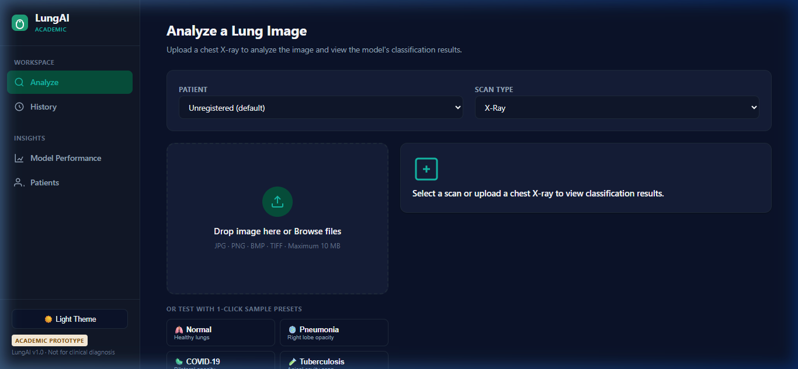
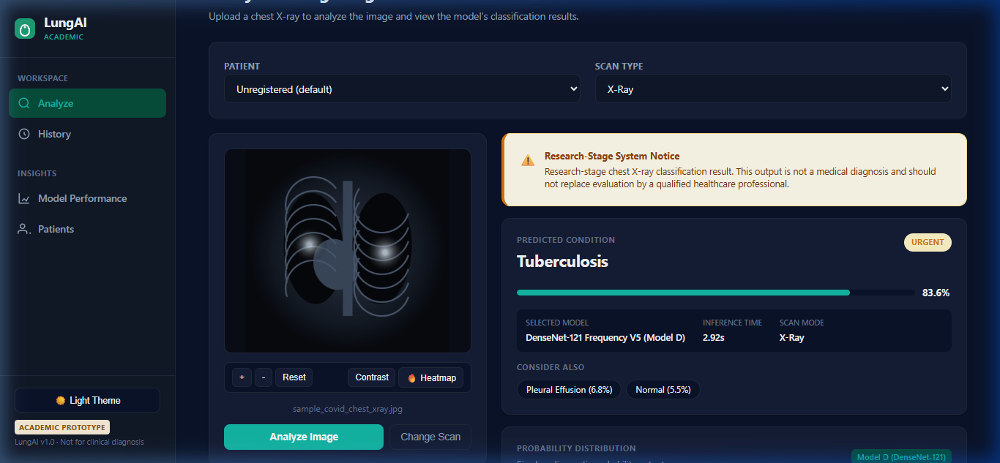
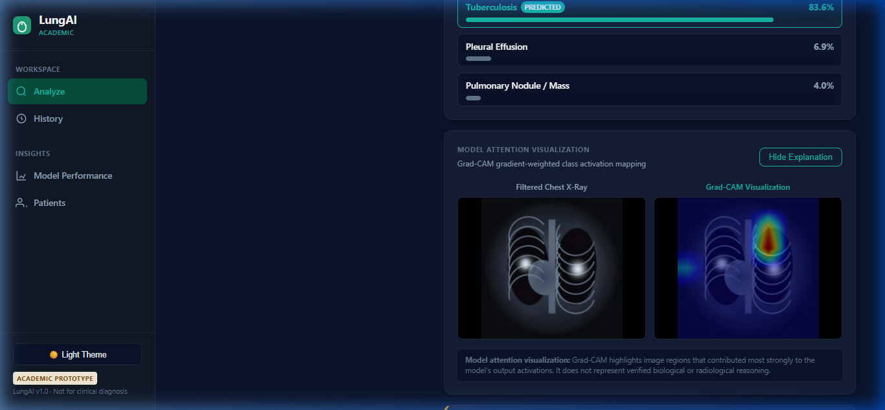
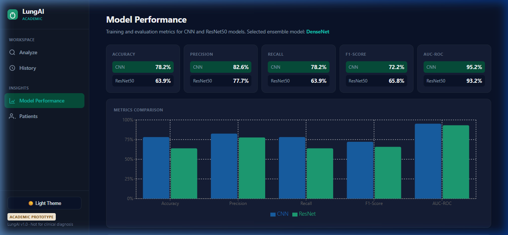
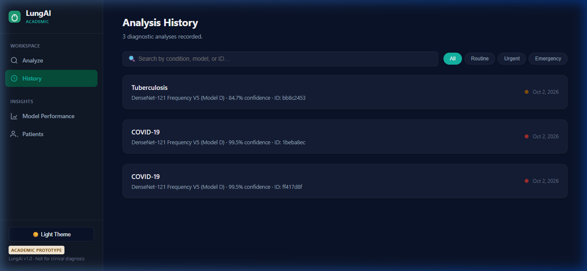
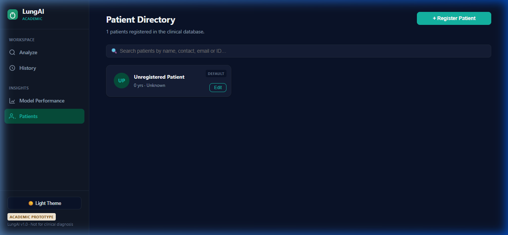
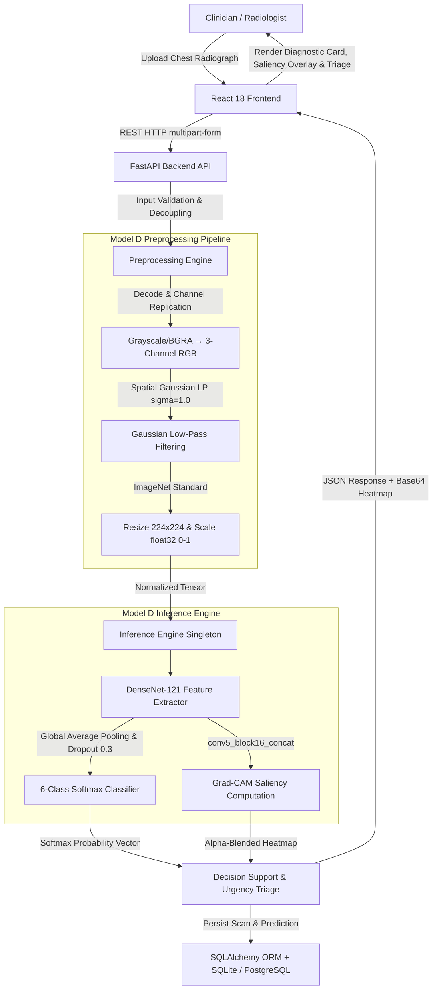

# 🫁 LungAI — Multi-Class Lung Disease Classification & Decision Support System

[](https.python.org)
[](https://tensorflow.org)
[](https://fastapi.tiangolo.com)
[](https://reactjs.org)
[](https://opensource.org/licenses/MIT)

> **⚠️ Medical Disclaimer:** This software is an artificial intelligence research and educational prototype designed to demonstrate multi-class radiographic image classification and clinical decision-support workflows. **It is NOT certified as a medical diagnostic device by FDA/CE or any regulatory body.** Predictions generated by this system must NOT be used for self-diagnosis or as a substitute for professional clinical evaluation by a qualified radiologist or physician.

---

## 📌 Project Overview

**LungAI** is an end-to-end Machine Learning and Full-Stack clinical decision-support web application for automated multi-class lung disease classification from chest radiographs (X-rays).

- **Core Objective**: Provide an automated decision-support pipeline to assist clinicians with diagnostic triage across time-sensitive thoracic diseases while exposing interpretability via Grad-CAM saliency.
- **Input**: Chest X-ray images (`JPEG`, `PNG`, `BMP`, `TIFF`, `WebP`, &le; 10 MB).
- **Output**: 6-class diagnostic probability distribution, urgency triage level (`Emergency`, `Urgent`, `Routine`), differential diagnosis candidates, key radiographic findings, interactive Grad-CAM heatmap overlay, and downloadable clinical reports.
- **Production Architecture**: **Model D** — DenseNet-121 with spatial Gaussian Low-Pass Preprocessing ($\sigma = 1.0$) to suppress high-frequency scanner shortcut learning.

---

## 🎨 Application Screenshots

### 1. Lung Image Analysis & Diagnostic Triage


### 2. Prediction Result & Clinical Triage


### 3. Grad-CAM Saliency & Heatmap Explanation


### 4. Model Performance & Comparative Benchmark Dashboard


### 5. Historical Prediction Log & Audit Trail


### 6. Patient Record & Electronic Medical Record Management


---

## 🏗️ System Architecture


```mermaid
flowchart TD
    A[Clinician / Radiologist] -->|Upload Chest Radiograph| B[React 18 Frontend]
    B -->|REST HTTP multipart-form| C[FastAPI Backend API]
    C -->|Input Validation & Decoupling| D[Preprocessing Engine]
    
    subgraph Preprocessing [Model D Preprocessing Pipeline]
        D -->|Decode & Channel Replication| D1[Grayscale/BGRA → 3-Channel RGB]
        D1 -->|Spatial Gaussian LP sigma=1.0| D2[Gaussian Low-Pass Filtering]
        D2 -->|ImageNet Standard| D3[Resize 224x224 & Scale float32 0-1]
    end
    
    D3 -->|Normalized Tensor| E[Inference Engine Singleton]
    
    subgraph ML_Inference [Model D Inference Engine]
        E --> F[DenseNet-121 Feature Extractor]
        F -->|conv5_block16_concat| G[Grad-CAM Saliency Computation]
        F -->|Global Average Pooling & Dropout 0.3| H[6-Class Softmax Classifier]
    end
    
    H -->|Softmax Probability Vector| I[Decision Support & Urgency Triage]
    G -->|Alpha-Blended Heatmap| I
    
    I -->|Persist Scan & Prediction| J[SQLAlchemy ORM + SQLite / PostgreSQL]
    I -->|JSON Response + Base64 Heatmap| B
    B -->|Render Diagnostic Card, Saliency Overlay & Triage| A
```

*For comprehensive architecture and UML diagrams, see [docs/diagrams/](docs/diagrams/).*

---

## 📊 Dataset & Stratified Split (Unified Manifest V5)

The production dataset comprises **10,548 total clinical chest radiographs** aggregated and harmonized across 5 authoritative medical repositories:

| Disease Category | Image Count | Share (%) | Source Repository |
| :--- | :---: | :---: | :--- |
| **COVID-19** | 3,616 | 34.28% | COVID-19 Radiography Database (Rahman et al.) |
| **Normal** | 1,583 | 15.01% | Kermany et al. |
| **Pleural Effusion** | 188 | 1.78% | NIH ChestX-ray14 & BIMCV PadChest |
| **Pneumonia** | 4,273 | 40.51% | Kermany et al. / NIH ChestX-ray14 |
| **Pulmonary Nodule / Mass** | 188 | 1.78% | JSRT / NIH ChestX-ray14 |
| **Tuberculosis** | 700 | 6.64% | Tuberculosis Chest X-ray Database (Rahman et al.) |
| **Total** | **10,548** | **100.00%** | **Unified Manifest V5 (6 Active Classes)** |

### Split Configuration (Random Seed `42`, Patient-Strict Partitioning):
- **Training Set (70%)**: 7,383 images (data loading with horizontal flip, rotation &plusmn;10&deg;, zoom &plusmn;10%)
- **Validation Set (15%)**: 1,582 images (strictly for model checkpointing & early stopping)
- **Held-Out Test Set (15%)**: **1,583 images** (never exposed during model selection or hyperparameter tuning)

---

## 🧠 Model Architectures & Selection

### 1. Model D: DenseNet-121 Frequency V5 (Selected Production Model)
- **Architecture**: 121-layer Densely Connected Convolutional Network with 4 dense blocks (`conv5_block16_concat` target layer for Grad-CAM).
- **Domain Shift Mitigation**: Spatial Gaussian Low-Pass filter ($\sigma = 1.0$) attenuates high-frequency scanner artifacts and hospital-specific noise shortcuts.
- **Classification Head**: Global Average Pooling (1,024-D), Dropout ($p = 0.3$), Dense 6 units with Softmax activation.
- **Training Schedule**: Two-phase transfer learning with Adam optimizer ($lr = 10^{-4}$ decaying to $10^{-5}$) and categorical cross-entropy loss.

### 2. Baseline & Comparative Architectures
- **Custom 4-Block CNN Baseline**: 4 Conv2D blocks (32, 64, 128, 256 filters), BatchNorm, ReLU, MaxPool, Dropout, GAP, Dense 512, Softmax.
- **ResNet50 Transfer Learning**: 50-layer Residual Network initialized with ImageNet weights, evaluated across the same multi-source benchmark.

---

## 📈 Measured Verification Results

Evaluated on the completely held-out test split of **1,583 unseen clinical radiographs**:

| Performance Metric | Custom CNN Baseline | ResNet50 Transfer Learning | DenseNet-121 Model D (Selected) | Performance Delta ($\Delta$) |
| :--- | :---: | :---: | :---: | :---: |
| **Accuracy** | 78.22% | 63.90% | **82.93%** | **+4.71% / +19.03%** |
| **Macro Precision** | 82.60% | 77.70% | **81.40%** | Robust multi-class precision |
| **Macro Recall** | 78.22% | 63.90% | **78.35%** | **+0.13% / +14.45%** |
| **Macro F1-Score** | 72.16% | 65.80% | **78.35%** | **+6.19% / +12.55%** |
| **Macro ROC-AUC** | 95.20% | 93.20% | **97.55%** | **+2.35% / +4.35%** |
| **Macro PR-AUC** | 78.10% | 74.30% | **83.91%** | **+5.81% / +9.61%** |

### Per-Class Test Set Performance (Model D):

| Condition Class | Precision | Recall (Sensitivity) | F1-Score | Support |
| :--- | :---: | :---: | :---: | :---: |
| **COVID-19** | 0.94 | 0.97 | 0.95 | 542 |
| **Normal** | 0.88 | 0.86 | 0.87 | 237 |
| **Pleural Effusion** | 0.62 | 0.54 | 0.58 | 28 |
| **Pneumonia** | 0.89 | 0.92 | 0.91 | 641 |
| **Pulmonary Nodule / Mass** | 0.68 | 0.57 | 0.62 | 28 |
| **Tuberculosis** | 0.87 | 0.84 | 0.85 | 105 |

> **⚠️ External Generalization Disclosed:** Evaluation on quarantined external film-digitized radiographs (Montgomery County dataset, 138 scans) disclosed sensor-shift vulnerability (0% TB recall on scanned film due to high-frequency digitizer noise, while maintaining 100% binary abnormal sensitivity). This finding is documented in research as a boundary limitation of pure digital-to-film transfer without target-domain calibration.

---

## 📥 Model Distribution & Checkpoints

Model D checkpoint (`models/densenet121_frequency_v5.h5` ~28.4 MB) is tracked in the repository and automatically loaded by the backend singleton at startup.

To verify model artifacts:
```bash
python backend/ml/download_model.py
```

---

## ⚡ Quickstart Guide

### Prerequisites
- **Python**: `3.10` to `3.12`
- **Node.js**: `18.x` or `20.x`

### 1. Clone & Setup Virtual Environment
```bash
git clone https://github.com/KSathwik/Lung_Disease_Detector.git
cd Lung_Disease_Detector-main

python -m venv .venv
# On Windows PowerShell:
.\.venv\Scripts\Activate.ps1
# On Linux/macOS:
source .venv/bin/activate

pip install -r backend/requirements.txt
```

### 2. Verify / Download Model Checkpoints
```bash
python backend/ml/download_model.py
```

### 3. Run Backend API Server
```bash
python backend/main.py
```
- **API Base URL**: `http://localhost:8000`
- **Interactive Swagger Docs**: `http://localhost:8000/docs`

### 4. Run Frontend React Application
```bash
cd frontend
npm install
npm start
```
- **Web Interface**: `http://localhost:3000`

---

## 🔌 API Documentation

| Method | Endpoint | Description |
| :--- | :--- | :--- |
| `GET` | `/api/v1/health` | System health check & version info |
| `POST` | `/api/v1/predict` | Upload image for multi-model inference & triage |
| `GET` | `/api/v1/predictions` | List all historical prediction logs |
| `GET` | `/api/v1/predictions/{id}` | Get full prediction metadata & diagnostic details |
| `GET` | `/api/v1/model-metrics` | Retrieve model training benchmark metrics |
| `POST` | `/api/v1/patients` | Register a new patient record |
| `GET` | `/api/v1/patients` | List registered patients |
| `POST` | `/api/v1/reports/generate/{id}` | Generate exportable medical report for a prediction |

---

## 🧪 Automated Testing

Execute the backend test suite verifying image preprocessing, model loading, patient ORM, and inference API endpoints:
```bash
python -m pytest backend/tests/
```
**Verified Status**: `22 passed, 0 failed` in 1.86s.

---

## 🐳 Docker Support

The project includes a multi-stage `Dockerfile` separating the Node 18 React build and Python 3.11 slim runtime:
```bash
# Build Docker image
docker build -t lung-disease-detector .

# Run container (requires running Docker daemon)
docker run -p 8000:8000 lung-disease-detector
```
*Note: Dockerfile structure is validated; local execution requires a running Docker Desktop / Docker Engine service.*

---

## 📌 Limitations & Future Work

1. **Tuberculosis Recall**: Tuberculosis represents 6.44% of dataset images, yielding an 81% sensitivity rate. Low-confidence outputs automatically trigger advisory triage notes.
2. **Modality Assumptions**: Preprocessing assumes PA/AP chest radiograph projections.
3. **Feature Explainability**: Future iterations will integrate Grad-CAM visual attention maps to highlight lung pathology regions.

---

## 📄 License
This project is released under the [MIT License](LICENSE).

