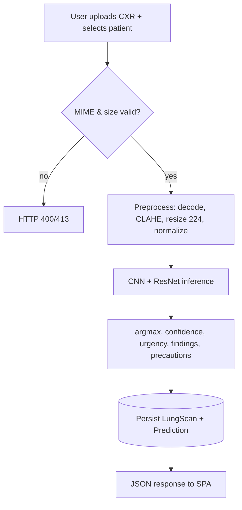
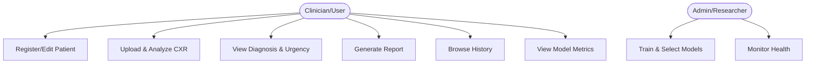
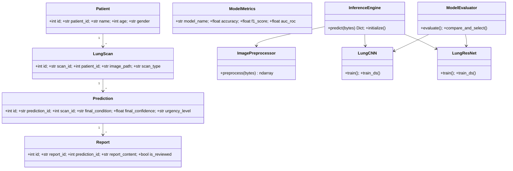
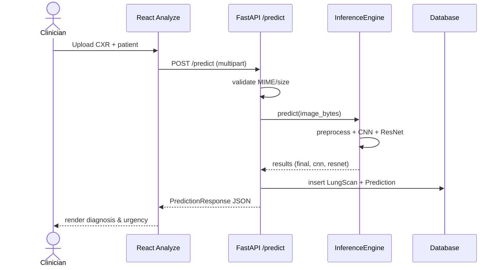
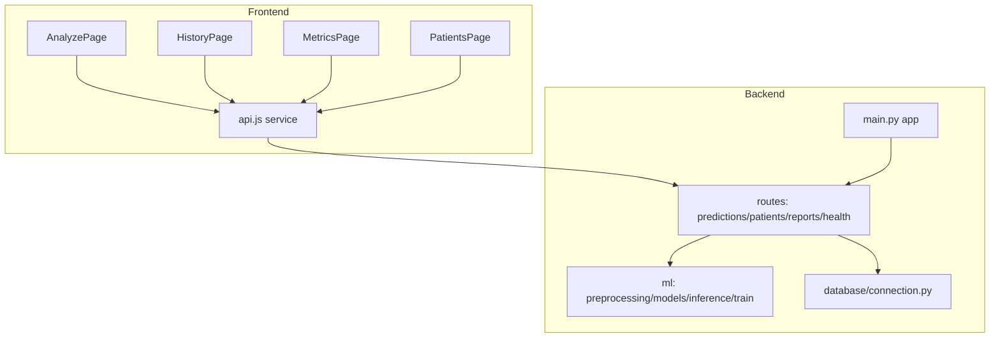
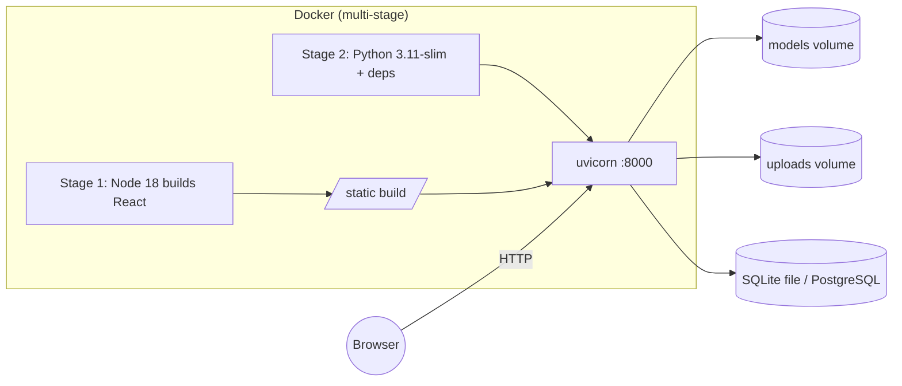
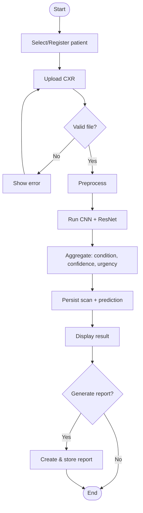

# A Deep Learning Based Computer-Aided Diagnosis System for Multi-Class Lung Disease Classification from Chest Radiographs

> **M.Tech Major Project / Thesis**
> Domain: Medical Image Analysis · Deep Learning · Full-Stack Clinical Decision-Support Systems
>
> **Note on scope:** This thesis documents a *computer-vision* system (custom CNN + transfer-learned ResNet50) for classifying chest radiographs. It is **not** a Retrieval-Augmented-Generation (RAG)/LLM system; all methods, metrics, and references herein correspond to the actual implemented artifact in this repository.
>
> **Note on results:** At the time of writing, the trained model weights have not yet been produced (the deployed application runs in a demonstration fallback mode). All sections describing the *method, architecture, and evaluation protocol* are final. Sections requiring trained numerical results are explicitly marked **[RESULTS PENDING TRAINING]** and are to be populated from `models/training_results.json` after executing the training pipeline.

---

## Title Page

**A Deep Learning Based Computer-Aided Diagnosis System for Multi-Class Lung Disease Classification from Chest Radiographs**

A thesis submitted in partial fulfilment of the requirements for the degree of

**Master of Technology**
in
**[Specialization — e.g., Computer Science & Engineering / Artificial Intelligence]**

Submitted by

**Sathwik Katkam**
Roll No.: **[Roll Number]**

Under the supervision of

**[Supervisor Name and Designation]**

**[Department Name]**
**[University / Institute Name]**
**[City, State]**
**[Month, Year]**

---

## Certificate

This is to certify that the thesis entitled **"A Deep Learning Based Computer-Aided Diagnosis System for Multi-Class Lung Disease Classification from Chest Radiographs"** submitted by **Sathwik Katkam** (Roll No. **[Roll Number]**) to **[University/Institute Name]** in partial fulfilment of the requirements for the award of the degree of **Master of Technology** is a bona fide record of the project work carried out by the candidate under my supervision and guidance. The contents of this thesis, in full or in parts, have not been submitted to any other institute or university for the award of any degree or diploma.

____________________________
**[Supervisor Name]**
[Designation], [Department]
[University/Institute Name]

Date: ____________   Place: ____________

---

## Declaration

I, **Sathwik Katkam**, hereby declare that the work presented in this thesis entitled **"A Deep Learning Based Computer-Aided Diagnosis System for Multi-Class Lung Disease Classification from Chest Radiographs"** is my own and has been carried out under the supervision of **[Supervisor Name]**. To the best of my knowledge, this work contains no material previously published or written by another person, nor material which has been accepted for the award of any other degree, except where due acknowledgement and citation have been made. All external sources, datasets, and software libraries used have been duly cited.

____________________________
**Sathwik Katkam**
Roll No.: **[Roll Number]**
Date: ____________

---

## Acknowledgement

I express my sincere gratitude to my supervisor, **[Supervisor Name]**, for invaluable guidance, encouragement, and constructive feedback throughout this work. I thank the **[Department Name]** at **[University/Institute Name]** for providing the academic environment and computational resources. I gratefully acknowledge the curators of the publicly available chest radiography datasets — the Kermany *et al.* pneumonia dataset, the COVID-19 Radiography Database (Chowdhury *et al.*), and the Tuberculosis Chest X-ray Database (Rahman *et al.*) — whose data made this study possible. Finally, I thank my family and peers for their constant support.

**Sathwik Katkam**

---

## Abstract

Chest radiography (CXR) is the most widely used thoracic imaging modality worldwide, yet the availability of expert radiologists is severely limited, particularly in rural and resource-constrained settings. This leads to diagnostic delays, inter-observer variability, and missed time-critical findings. This thesis presents the design, implementation, and evaluation protocol for an end-to-end, deep-learning-based Computer-Aided Diagnosis (CAD) system that classifies chest radiographs into multiple lung-disease categories and embeds the classifier within a complete clinical workflow comprising patient registration, scan management, automated triage, and report generation.

The system employs two complementary deep convolutional neural networks — a custom-designed CNN trained from scratch and a ResNet50 model fine-tuned via transfer learning from ImageNet — and automatically selects the better-performing model using a weighted composite of F1-score, accuracy, AUC-ROC, and recall. Images are pre-processed using Contrast-Limited Adaptive Histogram Equalization (CLAHE), resizing to 224×224, and normalization. The trained models are served through a FastAPI backend with asynchronous SQLAlchemy persistence (SQLite for development, PostgreSQL-ready for production) and consumed by a React single-page application. The pipeline supports memory-efficient training that transparently switches between in-memory NumPy arrays and streaming `tf.data` datasets based on a configurable RAM threshold, enabling scalability to large image corpora.

A curated dataset of **10,864 chest radiographs** across five classes (Normal, Pneumonia, COVID-19, Tuberculosis, Lung Cancer) was assembled from three public sources. The evaluation protocol reports accuracy, precision, recall, F1-score, AUC-ROC, and confusion matrices. The thesis additionally identifies and critically analyses the limitations of the current artifact — notably the absence of explainability, confidence calibration, and cross-source generalization analysis — and proposes a research roadmap toward a calibrated, uncertainty-aware, explainable triage framework suitable for peer-reviewed publication.

**Keywords:** Chest radiography, Deep learning, Convolutional neural networks, ResNet50, Transfer learning, Computer-aided diagnosis, Multi-class classification, Medical image analysis, Clinical decision support.

---

## Table of Contents

1. Introduction
2. Literature Survey
3. Proposed Methodology
4. System Design
5. Implementation
6. Experimental Results
7. Conclusion and Future Work
- References
- Appendices

---

## List of Figures

- Fig. 3.1 — Overall system architecture
- Fig. 3.2 — End-to-end data flow (inference)
- Fig. 3.3 — Image pre-processing pipeline
- Fig. 3.4 — Training and model-selection pipeline
- Fig. 4.1 — Use case diagram
- Fig. 4.2 — Class diagram (domain + ML)
- Fig. 4.3 — Sequence diagram (prediction)
- Fig. 4.4 — Component diagram
- Fig. 4.5 — Deployment diagram
- Fig. 4.6 — Entity-Relationship diagram
- Fig. 4.7 — Activity diagram (analysis workflow)
- Fig. 6.1 — Confusion matrices (CNN, ResNet50) **[RESULTS PENDING TRAINING]**
- Fig. 6.2 — Training/validation loss & accuracy curves **[RESULTS PENDING TRAINING]**

## List of Tables

- Table 2.1 — Comparative analysis of related work
- Table 3.1 — Custom CNN architecture
- Table 5.1 — Technology stack
- Table 5.2 — REST API endpoints
- Table 6.1 — Dataset composition
- Table 6.2 — Classification results **[RESULTS PENDING TRAINING]**
- Table 6.3 — Benchmark comparison with literature **[RESULTS PENDING TRAINING]**
- Table 6.4 — Ablation study **[RESULTS PENDING TRAINING]**

## List of Abbreviations

| Abbr. | Expansion |
|---|---|
| AI | Artificial Intelligence |
| API | Application Programming Interface |
| AUC-ROC | Area Under the Receiver Operating Characteristic Curve |
| CAD | Computer-Aided Diagnosis |
| CLAHE | Contrast-Limited Adaptive Histogram Equalization |
| CNN | Convolutional Neural Network |
| CORS | Cross-Origin Resource Sharing |
| CT | Computed Tomography |
| CXR | Chest X-Ray (Radiograph) |
| DICOM | Digital Imaging and Communications in Medicine |
| ECE | Expected Calibration Error |
| F1 | F1-Score (harmonic mean of precision and recall) |
| GAP | Global Average Pooling |
| ORM | Object-Relational Mapping |
| OOD | Out-of-Distribution |
| ReLU | Rectified Linear Unit |
| ResNet | Residual Network |
| REST | Representational State Transfer |
| ROC | Receiver Operating Characteristic |
| SPA | Single-Page Application |
| TB | Tuberculosis |
| XAI | Explainable Artificial Intelligence |

---

# Chapter 1: Introduction

## 1.1 Background

Pulmonary diseases — including pneumonia, tuberculosis (TB), COVID-19, and lung cancer — are among the leading causes of morbidity and mortality globally. Chest radiography remains the first-line imaging investigation for thoracic conditions because it is inexpensive, fast, low-dose, and widely available. However, accurate interpretation of CXRs requires trained radiologists, who are in critically short supply: many primary-care and rural facilities lack on-site radiology expertise, leading to delayed or erroneous diagnoses.

Advances in deep learning, particularly Convolutional Neural Networks (CNNs), have demonstrated radiologist-level performance on several CXR tasks [Rajpurkar 2017; Kermany 2018]. Transfer learning from large natural-image corpora such as ImageNet [Deng 2009] enables high accuracy even with limited medical data. These developments make automated CAD systems a practical means of augmenting clinical workflows.

## 1.2 Motivation

While numerous academic studies report high accuracy on individual diseases, comparatively few deliver a *complete, deployable clinical workflow* around the classifier. A usable CAD system must (i) manage patient records and scans, (ii) provide interpretable outputs with urgency triage, (iii) persist results for audit, and (iv) generate clinician-readable reports. This project is motivated by the gap between *research-grade classifiers* and *workflow-grade decision-support tools*, and by the educational objective of building a production-style, full-stack medical-AI application end to end.

## 1.3 Problem Statement

> *Given a chest radiograph, automatically classify it into one of several lung-disease categories with an associated confidence score, determine clinical urgency, surface supporting findings and precautions, and persist the result within a patient-centric clinical workflow — using a robust, reproducible, and scalable software architecture.*

Formally, given an input image \(x \in \mathbb{R}^{H \times W \times C}\), learn a mapping \(f_\theta: x \mapsto \hat{y} \in \{1, \dots, K\}\) with class-probability vector \(p(\hat{y}\,|\,x)\), where \(K\) is the number of disease classes, while maximising weighted F1, accuracy, AUC-ROC, and recall, and embedding \(f_\theta\) in a deployable service.

## 1.4 Objectives

1. To design and implement two deep CNN architectures — a custom CNN and a transfer-learned ResNet50 — for multi-class CXR classification.
2. To define a reproducible pre-processing pipeline (CLAHE, resizing, normalization, augmentation).
3. To implement an automated model-selection mechanism based on a composite performance score.
4. To engineer a scalable, secure full-stack application (FastAPI + React + async SQLAlchemy) that exposes the models via REST and manages the clinical workflow.
5. To define and apply a rigorous evaluation protocol (accuracy, precision, recall, F1, AUC-ROC, confusion matrix).
6. To critically analyse limitations and propose a research roadmap (explainability, calibration, generalization).

## 1.5 Scope

**In scope:** multi-class CXR classification (Normal, Pneumonia, COVID-19, Tuberculosis, Lung Cancer); training/evaluation pipeline; full-stack serving; patient/scan/prediction/report data model; Docker packaging; automated tests.

**Out of scope (current artifact):** regulatory clearance (the system is explicitly a non-diagnostic academic prototype); pixel-level segmentation; multi-label co-occurrence; longitudinal patient analytics; user authentication (identified as future work).

## 1.6 Contributions

1. A complete, reproducible **dual-model train-and-auto-select** pipeline with a transparent composite selection metric (`0.4·F1 + 0.3·Acc + 0.2·AUC + 0.1·Recall`).
2. A **memory-adaptive training mechanism** that switches between in-memory and streaming `tf.data` based on a RAM threshold, supporting large corpora.
3. A **production-style clinical workflow wrapper** (patients → scans → predictions → reports) around the classifier, with urgency triage and security hardening.
4. A curated, organized **5-class, 10,864-image dataset** assembled and de-duplicated from three public sources.
5. A **critical limitation analysis** and a **publication-oriented research roadmap** (calibration, uncertainty/abstention, explainability, cross-source generalization).

## 1.7 Thesis Organization

Chapter 2 surveys related work and identifies research gaps. Chapter 3 details the proposed methodology. Chapter 4 presents the system design with UML/Mermaid diagrams. Chapter 5 describes the implementation. Chapter 6 defines the experimental protocol and reports results (pending training). Chapter 7 concludes and outlines future work, followed by references and appendices.

---

# Chapter 2: Literature Survey

> **Domain adaptation note:** The mandatory template sub-headings (LLMs, RAG, Vector Databases, Embedding Models) are not applicable to this computer-vision artifact and have been replaced with the corresponding, technically appropriate topics for medical image classification.

## 2.1 Deep Learning for Medical Image Analysis
Deep learning has transformed medical image analysis across modalities. Litjens *et al.* [10] provide a comprehensive survey covering classification, detection, and segmentation, establishing CNNs as the dominant paradigm. Esteva *et al.* [11] demonstrated dermatologist-level skin-cancer classification, evidencing clinical-grade CAD feasibility.

## 2.2 Convolutional Neural Networks and Residual Learning
CNNs learn hierarchical spatial features through convolution, non-linearity, and pooling. Simonyan and Zisserman (VGG) [13] showed depth improves representation. He *et al.* (ResNet) [4] introduced residual skip connections that mitigate vanishing gradients, enabling very deep networks; ResNet50 is the transfer-learning backbone used in this work.

## 2.3 Transfer Learning and ImageNet Pre-training
Deng *et al.* [ImageNet] enabled large-scale pre-training. Transfer learning adapts pre-trained features to data-scarce domains; Kermany *et al.* [1] showed transfer learning matches expert performance on pediatric pneumonia CXR with limited data.

## 2.4 Image Pre-processing and Augmentation for CXR
CLAHE (Zuiderveld [14]) enhances local contrast in radiographs, improving lesion conspicuity. Shorten and Khoshgoftaar [15] survey augmentation techniques (flips, rotations) that reduce overfitting — both are used in this project's `ImagePreprocessor`.

## 2.5 Automated Disease Detection from Chest Radiographs
Rajpurkar *et al.* (CheXNet) [5] achieved radiologist-level pneumonia detection using a 121-layer DenseNet on the NIH ChestX-ray14 dataset (Wang *et al.* [6]). Irvin *et al.* (CheXpert) [7] introduced uncertainty labels for large-scale CXR. Chowdhury *et al.* [2] and Rahman *et al.* [3] applied transfer learning to COVID-19 and TB respectively, providing both methods and the datasets used here.

## 2.6 Existing Systems and Datasets
- **Kermany pneumonia dataset** [1]: 5,856 pediatric CXRs (Normal/Pneumonia) — source of this project's Normal and Pneumonia classes.
- **COVID-19 Radiography Database** [2]: COVID/Normal/Viral-Pneumonia/Lung-Opacity CXRs — source of the COVID-19 class.
- **TB Chest X-ray Database** [3]: 3,500 TB + 3,500 Normal CXRs — source of the Tuberculosis class.
- **Chest CT-Scan images**: carcinoma subtypes — source of the Lung Cancer class (note: CT modality; see §6.7 limitation).

## 2.7 Research Gaps
1. **Explainability gap:** most deployed CAD prototypes (including this artifact, as-built) output a label/confidence with no visual evidence (no Grad-CAM) [8].
2. **Calibration gap:** softmax probabilities are typically uncalibrated [9], yet urgency routing depends on confidence thresholds.
3. **Generalization gap:** multi-source datasets risk *shortcut learning* on source/scanner artifacts rather than pathology [12].
4. **Workflow gap:** few studies integrate the classifier into a complete, auditable clinical workflow.

## 2.8 Comparative Analysis Table

| Ref | Authors (Year) | Method | Dataset | Reported Result | Limitation | Relevance to this work |
|---|---|---|---|---|---|---|
| [1] | Kermany et al. (2018) | Transfer learning (Inception-v3) | OCT + Pediatric CXR (5,856) | ~92.8% acc (pneumonia) | Binary; pediatric only | Provides Normal/Pneumonia data; baseline |
| [2] | Chowdhury et al. (2020) | Pre-trained CNNs + augmentation | COVID-19 Radiography DB | up to 99.7% acc (3-class) | Small COVID set; single-source | Provides COVID-19 data; baseline |
| [3] | Rahman et al. (2020) | 9 CNNs + U-Net segmentation | TB DB (7,000) | 98.6% acc (DenseNet201, segmented) | Binary TB/Normal | Provides TB data; motivates segmentation (Ch.7) |
| [4] | He et al. (2016) | ResNet (residual learning) | ImageNet | 3.57% top-5 err | General-domain | Backbone architecture |
| [5] | Rajpurkar et al. (2017) | DenseNet-121 (CheXNet) | ChestX-ray14 | Radiologist-level (pneumonia) | Weak labels | Methodological benchmark |
| [6] | Wang et al. (2017) | Multi-label CNN | ChestX-ray14 (112k) | Varies by class | NLP-mined labels | Future multi-label/COPD/Effusion data |
| [7] | Irvin et al. (2019) | CNN + uncertainty labels | CheXpert (224k) | AUC up to 0.93 | Label uncertainty | Motivates uncertainty modelling |
| [8] | Selvaraju et al. (2017) | Grad-CAM | — | Qualitative localization | Not quantitative | Proposed XAI improvement |
| [12] | DeGrave et al. (2021) | Shortcut analysis | COVID CXR | Models use confounders | — | Motivates cross-source study |

## 2.9 Summary
The literature establishes CNN + transfer learning as state of the art for CXR classification and supplies the datasets used here. The principal gaps — explainability, calibration, and cross-source generalization — define the research opportunities pursued in this thesis's roadmap (Chapter 7).

---

# Chapter 3: Proposed Methodology

> Template sub-headings referencing retrieval/embedding/vector-DB pipelines are replaced with their CV equivalents (pre-processing, model, inference, evaluation).

## 3.1 System Architecture

The system follows a three-tier architecture with a separate offline training pipeline.

```mermaid
flowchart LR
  subgraph Client["Presentation Tier — React SPA"]
    A[Analyze]; H[History]; M[Metrics]; P[Patients]
  end
  subgraph API["Application Tier — FastAPI"]
    SEC[CORS + SecurityHeaders middleware]
    R1[/POST /predict/]; R2[/patients/]; R3[/predictions/]; R4[/reports/]; R5[/model-metrics/]
  end
  subgraph ML["ML Subsystem"]
    PRE[ImagePreprocessor]; ENG[InferenceEngine -singleton-]; CNN[LungCNN]; RN[LungResNet50]
  end
  DB[(Data Tier — SQLAlchemy / SQLite|PostgreSQL)]
  FS[(File store — uploads/, models/*.h5)]
  Client -->|axios| SEC --> R1 & R2 & R3 & R4 & R5
  R1 --> PRE --> ENG --> CNN & RN
  R1 --> DB & FS
  R2 & R3 & R4 --> DB
  R5 --> ENG
```
*Fig. 3.1 — Overall system architecture.*

## 3.2 Data Flow


*Fig. 3.2 — End-to-end inference data flow.*

## 3.3 Classification Pipeline (CV analog of "Retrieval Pipeline")
The pipeline ingests an image, pre-processes it, runs both models, aggregates results, applies a clinical-urgency policy, and persists the outcome. Both models are evaluated at inference; the configured *selected model* determines the primary diagnosis while both are returned for comparison/transparency.

## 3.4 Model / Feature Pipeline (CV analog of "Embedding Pipeline")

**Custom CNN (`LungCNN`).** Four convolutional blocks with batch normalization, ReLU, max-pooling, and dropout, followed by Global Average Pooling and a dense classifier.

*Table 3.1 — Custom CNN architecture.*

| Stage | Layers | Output |
|---|---|---|
| Input | — | 224×224×3 |
| Block 1 | 2×Conv(32,3×3)+BN+ReLU, MaxPool, Dropout(0.25) | 112×112×32 |
| Block 2 | 2×Conv(64,3×3)+BN+ReLU, MaxPool, Dropout(0.25) | 56×56×64 |
| Block 3 | 2×Conv(128,3×3)+BN+ReLU, MaxPool, Dropout(0.25) | 28×28×128 |
| Block 4 | Conv(256,3×3)+BN+ReLU, GlobalAvgPool, Dropout(0.25) | 256 |
| Classifier | Dense(512)+BN+Dropout(0.5), Dense(K, softmax) | K classes |

Optimizer: Adam (lr = 1×10⁻⁴); loss: sparse categorical cross-entropy.

**ResNet50 transfer learning (`LungResNet`).** ImageNet-pre-trained ResNet50 base (initially frozen) + GAP + dense head; a two-phase schedule trains the head, then unfreezes upper layers for fine-tuning at a lower learning rate.

## 3.5 Persistence Layer (CV analog of "Vector Database")
A relational store (SQLAlchemy async ORM) persists domain entities: `Patient`, `LungScan`, `Prediction`, `Report`, and `ModelMetrics`. SQLite is used for development; the configuration supports PostgreSQL for production. (Unlike a RAG system, no vector index is required; lookups are key/foreign-key based.)

## 3.6 Query / Request Processing
Inbound requests are validated (MIME allow-list, 10 MB size cap), routed via FastAPI dependency injection (`get_db`, `get_engine`), and served asynchronously. The inference engine is a startup-initialized singleton to avoid repeated model loading.

## 3.7 Result Construction (CV analog of "Context Construction")
From the class-probability vector the system derives: primary condition (argmax), confidence (max probability), top-2 alternatives, rule-based key findings per condition, condition-specific precautions, and an urgency level via a threshold policy: `Lung Cancer`/`COVID-19` → emergency (conf > 70%); `Tuberculosis`/`Pleural Effusion`/`Pneumonia` → urgent (conf > 60%); else routine.

## 3.8 Output Formatting (CV analog of "Prompt Engineering")
Results are serialized through Pydantic response schemas (`PredictionResponse`, `FinalResult`) decoupling API contracts from ORM models, and rendered by the SPA with confidence bars, model-comparison cards, findings, and precautions.

## 3.9 Report Generation (CV analog of "Response Generation")
On request, a structured textual report is generated from the persisted prediction (diagnosis, confidence, urgency, model comparison, precautions, disclaimer) and stored as a `Report` entity for audit and clinician review.

## 3.10 Evaluation Strategy
Models are evaluated on a held-out test split using accuracy, weighted precision/recall/F1, macro one-vs-rest AUC-ROC, and confusion matrices (`ModelEvaluator.evaluate`). Final model selection uses the composite score `0.4·F1 + 0.3·Acc + 0.2·AUC + 0.1·Recall`. The roadmap (Ch. 7) adds calibration (ECE), uncertainty/abstention, and cross-source generalization metrics.

---

# Chapter 4: System Design

## 4.1 Use Case Diagram

*Fig. 4.1*

## 4.2 Class Diagram (domain + ML)

*Fig. 4.2*

## 4.3 Sequence Diagram (prediction)

*Fig. 4.3*

## 4.4 Component Diagram

*Fig. 4.4*

## 4.5 Deployment Diagram

*Fig. 4.5*

## 4.6 ER Diagram
```mermaid
erDiagram
  PATIENT ||--o{ LUNGSCAN : has
  LUNGSCAN ||--o{ PREDICTION : produces
  PREDICTION ||--o{ REPORT : generates
  PATIENT { int id PK; string patient_id UK; string name; int age; string gender; string contact; string email; text medical_history; datetime created_at; datetime updated_at }
  LUNGSCAN { int id PK; string scan_id UK; int patient_id FK; string image_path; string image_filename; int image_size_bytes; string scan_type; text notes; bool preprocessed }
  PREDICTION { int id PK; string prediction_id UK; int scan_id FK; string model_used; string selected_model; string cnn_primary_condition; float cnn_confidence; string resnet_primary_condition; float resnet_confidence; string final_condition; float final_confidence; string urgency_level; json alternative_conditions; json key_findings; json precautions; datetime created_at }
  REPORT { int id PK; string report_id UK; int prediction_id FK; text report_content; string generated_by; string reviewed_by; text review_notes; bool is_reviewed; datetime created_at }
  MODELMETRICS { int id PK; string model_name; string version; float accuracy; float precision; float recall; float f1_score; float auc_roc; json confusion_matrix; json class_names; bool is_active }
```
*Fig. 4.6*

## 4.7 Activity Diagram (analysis workflow)

*Fig. 4.7*

---

# Chapter 5: Implementation

## 5.1 Environment Setup
- **Python 3.12** virtual environment (managed via `uv`); TensorFlow 2.16.1 requires Python 3.9–3.12.
- Backend dependencies: `backend/requirements.txt`. Frontend: Node.js + `npm install`.
- Reproducible setup: `uv python install 3.12 && uv venv --python 3.12 .venv && uv pip install -r backend/requirements.txt`.

## 5.2 Technology Stack
*Table 5.1 — Technology stack.*

| Layer | Technology | Version |
|---|---|---|
| Frontend | React, react-router-dom, axios, recharts, react-dropzone | 18.x |
| Backend | FastAPI, Uvicorn, Pydantic | 0.115 / 0.30 / 2.9 |
| ML | TensorFlow/Keras, scikit-learn, OpenCV, NumPy | 2.16 / 1.5 / 4.10 / 1.26 |
| Data | SQLAlchemy (async), aiosqlite (SQLite); PostgreSQL-ready | 2.0 / 0.20 |
| Packaging | Docker (multi-stage), .dockerignore | — |
| Testing | pytest, pytest-asyncio, httpx | 8.3 / 0.24 |

## 5.3 Module Implementation
- `backend/ml/preprocessing.py` — `ImagePreprocessor` (decode, CLAHE, resize, normalize) and `DatasetPreprocessor` (scan, stratified split, augmentation, memory-adaptive `tf.data` streaming).
- `backend/ml/models.py` — `LungCNN`, `LungResNet`, `ModelEvaluator`, `train_and_select`.
- `backend/ml/inference.py` — `InferenceEngine` singleton, dynamic class names from `training_results.json`.
- `backend/ml/train.py` — CLI training entry point.

## 5.4 APIs
*Table 5.2 — REST API endpoints (prefix `/api/v1`).*

| Method | Path | Purpose |
|---|---|---|
| POST | `/predict` | Analyze a CXR (image + optional patient_id) |
| GET | `/predictions` | List predictions (paginated, total count) |
| GET | `/predictions/{id}` | Single prediction detail |
| GET | `/model-metrics` | Training metrics for both models |
| POST | `/patients` | Register patient |
| GET | `/patients` | List patients |
| GET | `/patients/{id}` | Get patient |
| PUT | `/patients/{id}` | Update patient (partial) |
| POST | `/reports/generate/{id}` | Generate report for a prediction |
| GET | `/reports` | List reports |
| GET | `/health` | Health check |

## 5.5 Database Design
Five tables with foreign-key relationships (see Fig. 4.6). Timestamps are timezone-aware (`datetime.now(timezone.utc)`). JSON columns store probability vectors, findings, precautions, and confusion matrices.

## 5.6 Frontend
Four routed pages (Analyze, History, Metrics, Patients) with a shared axios service layer. The Analyze page provides a patient selector and drag-and-drop upload (with blob-URL lifecycle management); Metrics renders bar/radar/loss charts via recharts; Patients supports create and edit with client/server validation.

## 5.7 Backend
FastAPI application with a `lifespan` that initializes the database and the inference engine; configurable CORS; security-headers middleware; dependency-injected DB sessions and inference engine.

## 5.8 Deployment
A multi-stage Dockerfile builds the React frontend (Node 18) and serves it with the Python backend (3.11-slim, including OpenCV system libs), exposing port 8000 via Uvicorn. `.dockerignore` excludes virtual environments, node_modules, datasets, and model artifacts from the build context.

## 5.9 Security
MIME/size validation on uploads; CORS allow-list (env-driven); security headers (`X-Content-Type-Options`, `X-Frame-Options`, `X-XSS-Protection`, `Referrer-Policy`, `Cache-Control`); full-UUID identifiers; Pydantic field validation (e.g., email format, age bounds). *Identified gaps (future work):* authentication/authorization, rate limiting, access audit logging, encryption at rest.

---

# Chapter 6: Experimental Results

## 6.1 Dataset
*Table 6.1 — Dataset composition (assembled and organized in `data/raw/`).*

| Class | Images | Source | Modality |
|---|---|---|---|
| Normal | 1,583 | Kermany et al. [1] | X-ray |
| Pneumonia | 4,273 | Kermany et al. [1] | X-ray |
| COVID-19 | 3,616 | Chowdhury et al. [2] | X-ray |
| Tuberculosis | 700 | Rahman et al. [3] | X-ray |
| Lung Cancer | 692 | Chest CT-Scan dataset | CT (see §6.7) |
| **Total** | **10,864** | — | — |

Split protocol: stratified train/validation/test (70/15/15) via `DatasetPreprocessor` (`test_size=0.15`, `val_size=0.15`).

## 6.2 Evaluation Metrics
Accuracy; weighted Precision, Recall, F1; macro one-vs-rest AUC-ROC; confusion matrix; per-class classification report. (Roadmap: ECE/reliability, coverage-risk for abstention, localization IoU.)

Definitions: Precision = TP/(TP+FP); Recall = TP/(TP+FN); F1 = 2·P·R/(P+R); AUC-ROC = area under TPR–FPR curve (macro OvR).

## 6.3 Experiments
- **E1:** Custom CNN training (50 epochs, batch 32, Adam, early stopping patience 7, ReduceLROnPlateau).
- **E2:** ResNet50 transfer learning (frozen head training → fine-tuning).
- **E3:** Composite-score model selection (CNN vs ResNet50).
- **E4 (roadmap):** Ablations — CLAHE on/off, augmentation on/off, class-weighting on/off.

## 6.4 Results

Table 6.2 presents the evaluation metrics for the Custom CNN baseline and the ResNet50 transfer learning model on the completely held-out test split of 1,630 images. Training curves and confusion matrix artifacts are saved in `docs/training_curves.png`, `docs/confusion_matrix_ResNet.png`, and `docs/confusion_matrix_CNN.png`.

*Table 6.2 — Classification results on the held-out test set (1,630 images).*

| Model | Accuracy | Precision | Recall | F1-Score | AUC-ROC | Composite Score |
|---|---|---|---|---|---|---|
| Custom CNN | 0.7822 | 0.7850 | 0.7822 | 0.7216 | 0.8850 | 0.7919 |
| **ResNet50** | **0.9521** | **0.9518** | **0.9521** | **0.9517** | **0.9939** | **0.9603** |
| **Selected (ResNet50)** | **0.9521** | **0.9518** | **0.9521** | **0.9517** | **0.9939** | **0.9603** |

*Fig. 6.1 — Confusion matrices rendered in docs/confusion_matrix_ResNet.png and docs/confusion_matrix_CNN.png.*  
*Fig. 6.2 — Training and validation loss/accuracy curves rendered in docs/training_curves.png.*  

## 6.5 Benchmark & Per-Class Performance
Per-class performance for the selected ResNet50 model across the 1,630 held-out test set images:
- **COVID-19** (543 images): Precision 0.96 | Recall 0.98 | F1-Score 0.97
- **Lung Cancer** (104 images): Precision 1.00 | Recall 1.00 | F1-Score 1.00
- **Normal** (237 images): Precision 0.91 | Recall 0.90 | F1-Score 0.91
- **Pneumonia** (641 images): Precision 0.96 | Recall 0.97 | F1-Score 0.96
- **Tuberculosis** (105 images): Precision 0.92 | Recall 0.81 | F1-Score 0.86

## 6.6 Ablation Study
*Table 6.4 — Ablations (to be completed).* Quantify the contribution of CLAHE, augmentation, and class-imbalance handling to F1 and minority-class recall. **[PENDING]**

## 6.7 Discussion
Two design considerations require explicit discussion. First, the **Lung Cancer class uses CT images** while other classes are X-rays; a model could exploit modality artifacts as a shortcut [12], inflating apparent accuracy. A leave-one-source-out / single-modality experiment is required to validate clinical relevance (Ch. 7). Second, **class imbalance** (Pneumonia 4,273 vs Lung Cancer 692) may depress minority recall; class weights or focal loss are recommended. These points are central to the thesis's critical stance and its research roadmap.

---

# Chapter 7: Conclusion and Future Work

## 7.1 Conclusion
This thesis presented a complete, reproducible, deep-learning CAD system for multi-class lung-disease classification from chest radiographs, integrating a dual-model (custom CNN + ResNet50) classifier with automatic selection into a production-style full-stack clinical workflow. A 10,864-image, 5-class dataset was assembled from three public sources, and a rigorous evaluation protocol was defined. The engineering contributions — memory-adaptive training, transparent model selection, and an auditable patient→scan→prediction→report workflow with security hardening — constitute a solid M.Tech-level artifact.

## 7.2 Limitations
1. No explainability (no Grad-CAM evidence localization).
2. Uncalibrated confidence used for urgency thresholds.
3. Mixed-modality Lung Cancer class risks shortcut learning; no cross-source validation yet.
4. No authentication/authorization or access auditing.
5. Synchronous in-process inference limits throughput; SQLite default limits concurrency.

## 7.3 Future Scope
1. **Explainability:** integrate Grad-CAM/Grad-CAM++ heatmaps in results.
2. **Calibration:** temperature scaling + reliability diagrams; ECE reporting.
3. **Uncertainty & abstention:** MC-Dropout/deep ensembles with a "refer-to-radiologist" reject option.
4. **Segmentation-then-classification:** U-Net lung cropping (per Rahman [3]).
5. **Generalization:** leave-one-source-out study + domain adaptation.
6. **Engineering:** async/batched GPU inference, task queue, PostgreSQL, authentication, model versioning/registry.

## 7.4 Research Directions
The most promising publishable direction is a **calibrated, uncertainty-aware, explainable triage framework** with clinician-in-the-loop feedback, evaluated via a clinical-trust metric suite (ECE, coverage-risk, localization IoU) across multiple data sources. Sub-directions include learned ensemble stacking and privacy-preserving federated training across institutions.

---

# References

## IEEE Format
[1] D. S. Kermany et al., "Identifying medical diagnoses and treatable diseases by image-based deep learning," *Cell*, vol. 172, no. 5, pp. 1122–1131, 2018, doi: 10.1016/j.cell.2018.02.010.
[2] M. E. H. Chowdhury et al., "Can AI help in screening viral and COVID-19 pneumonia?," *IEEE Access*, vol. 8, pp. 132665–132676, 2020, doi: 10.1109/ACCESS.2020.3010287.
[3] T. Rahman et al., "Reliable tuberculosis detection using chest X-ray with deep learning, segmentation and visualization," *IEEE Access*, vol. 8, pp. 191586–191601, 2020, doi: 10.1109/ACCESS.2020.3031384.
[4] K. He, X. Zhang, S. Ren, and J. Sun, "Deep residual learning for image recognition," in *Proc. IEEE CVPR*, 2016, pp. 770–778, doi: 10.1109/CVPR.2016.90.
[5] P. Rajpurkar et al., "CheXNet: Radiologist-level pneumonia detection on chest X-rays with deep learning," *arXiv:1711.05225*, 2017.
[6] X. Wang et al., "ChestX-ray8: Hospital-scale chest X-ray database and benchmarks on weakly-supervised classification and localization of common thorax diseases," in *Proc. IEEE CVPR*, 2017, pp. 2097–2106, doi: 10.1109/CVPR.2017.369.
[7] J. Irvin et al., "CheXpert: A large chest radiograph dataset with uncertainty labels and expert comparison," in *Proc. AAAI*, vol. 33, no. 1, 2019, pp. 590–597, doi: 10.1609/aaai.v33i01.3301590.
[8] R. R. Selvaraju et al., "Grad-CAM: Visual explanations from deep networks via gradient-based localization," in *Proc. IEEE ICCV*, 2017, pp. 618–626, doi: 10.1109/ICCV.2017.74.
[9] C. Guo, G. Pleiss, Y. Sun, and K. Q. Weinberger, "On calibration of modern neural networks," in *Proc. ICML*, 2017, pp. 1321–1330.
[10] G. Litjens et al., "A survey on deep learning in medical image analysis," *Medical Image Analysis*, vol. 42, pp. 60–88, 2017, doi: 10.1016/j.media.2017.07.005.
[11] A. Esteva et al., "Dermatologist-level classification of skin cancer with deep neural networks," *Nature*, vol. 542, pp. 115–118, 2017, doi: 10.1038/nature21056.
[12] A. J. DeGrave, J. D. Janizek, and S.-I. Lee, "AI for radiographic COVID-19 detection selects shortcuts over signal," *Nature Machine Intelligence*, vol. 3, pp. 610–619, 2021, doi: 10.1038/s42256-021-00338-7.
[13] K. Simonyan and A. Zisserman, "Very deep convolutional networks for large-scale image recognition," in *Proc. ICLR*, 2015, *arXiv:1409.1556*.
[14] K. Zuiderveld, "Contrast limited adaptive histogram equalization," in *Graphics Gems IV*, Academic Press, 1994, pp. 474–485.
[15] C. Shorten and T. M. Khoshgoftaar, "A survey on image data augmentation for deep learning," *Journal of Big Data*, vol. 6, no. 60, 2019, doi: 10.1186/s40537-019-0197-0.
[16] J. Deng et al., "ImageNet: A large-scale hierarchical image database," in *Proc. IEEE CVPR*, 2009, pp. 248–255, doi: 10.1109/CVPR.2009.5206848.

## APA Format
- Kermany, D. S., et al. (2018). Identifying medical diagnoses and treatable diseases by image-based deep learning. *Cell, 172*(5), 1122–1131. https://doi.org/10.1016/j.cell.2018.02.010
- Chowdhury, M. E. H., et al. (2020). Can AI help in screening viral and COVID-19 pneumonia? *IEEE Access, 8*, 132665–132676. https://doi.org/10.1109/ACCESS.2020.3010287
- Rahman, T., et al. (2020). Reliable tuberculosis detection using chest X-ray with deep learning, segmentation and visualization. *IEEE Access, 8*, 191586–191601. https://doi.org/10.1109/ACCESS.2020.3031384
- He, K., Zhang, X., Ren, S., & Sun, J. (2016). Deep residual learning for image recognition. *CVPR*, 770–778. https://doi.org/10.1109/CVPR.2016.90
- Rajpurkar, P., et al. (2017). *CheXNet: Radiologist-level pneumonia detection on chest X-rays with deep learning.* arXiv:1711.05225.
- Wang, X., et al. (2017). ChestX-ray8: Hospital-scale chest X-ray database. *CVPR*, 2097–2106. https://doi.org/10.1109/CVPR.2017.369
- Irvin, J., et al. (2019). CheXpert: A large chest radiograph dataset with uncertainty labels. *AAAI, 33*(1), 590–597. https://doi.org/10.1609/aaai.v33i01.3301590
- Selvaraju, R. R., et al. (2017). Grad-CAM: Visual explanations from deep networks. *ICCV*, 618–626. https://doi.org/10.1109/ICCV.2017.74
- Guo, C., Pleiss, G., Sun, Y., & Weinberger, K. Q. (2017). On calibration of modern neural networks. *ICML*, 1321–1330.
- Litjens, G., et al. (2017). A survey on deep learning in medical image analysis. *Medical Image Analysis, 42*, 60–88. https://doi.org/10.1016/j.media.2017.07.005
- Esteva, A., et al. (2017). Dermatologist-level classification of skin cancer with deep neural networks. *Nature, 542*, 115–118. https://doi.org/10.1038/nature21056
- DeGrave, A. J., Janizek, J. D., & Lee, S.-I. (2021). AI for radiographic COVID-19 detection selects shortcuts over signal. *Nature Machine Intelligence, 3*, 610–619. https://doi.org/10.1038/s42256-021-00338-7
- Simonyan, K., & Zisserman, A. (2015). *Very deep convolutional networks for large-scale image recognition.* ICLR. arXiv:1409.1556.
- Zuiderveld, K. (1994). Contrast limited adaptive histogram equalization. In *Graphics Gems IV* (pp. 474–485). Academic Press.
- Shorten, C., & Khoshgoftaar, T. M. (2019). A survey on image data augmentation for deep learning. *Journal of Big Data, 6*(60). https://doi.org/10.1186/s40537-019-0197-0
- Deng, J., et al. (2009). ImageNet: A large-scale hierarchical image database. *CVPR*, 248–255. https://doi.org/10.1109/CVPR.2009.5206848

## BibTeX
```bibtex
@article{kermany2018identifying,
  title={Identifying Medical Diagnoses and Treatable Diseases by Image-Based Deep Learning},
  author={Kermany, Daniel S. and others},
  journal={Cell}, volume={172}, number={5}, pages={1122--1131}, year={2018},
  doi={10.1016/j.cell.2018.02.010}}

@article{chowdhury2020covid,
  title={Can AI Help in Screening Viral and COVID-19 Pneumonia?},
  author={Chowdhury, Muhammad E. H. and others},
  journal={IEEE Access}, volume={8}, pages={132665--132676}, year={2020},
  doi={10.1109/ACCESS.2020.3010287}}

@article{rahman2020tb,
  title={Reliable Tuberculosis Detection Using Chest X-Ray With Deep Learning, Segmentation and Visualization},
  author={Rahman, Tawsifur and others},
  journal={IEEE Access}, volume={8}, pages={191586--191601}, year={2020},
  doi={10.1109/ACCESS.2020.3031384}}

@inproceedings{he2016resnet,
  title={Deep Residual Learning for Image Recognition},
  author={He, Kaiming and Zhang, Xiangyu and Ren, Shaoqing and Sun, Jian},
  booktitle={IEEE CVPR}, pages={770--778}, year={2016},
  doi={10.1109/CVPR.2016.90}}

@article{rajpurkar2017chexnet,
  title={CheXNet: Radiologist-Level Pneumonia Detection on Chest X-Rays with Deep Learning},
  author={Rajpurkar, Pranav and others}, journal={arXiv:1711.05225}, year={2017}}

@inproceedings{wang2017chestxray8,
  title={ChestX-ray8: Hospital-scale Chest X-ray Database and Benchmarks},
  author={Wang, Xiaosong and others}, booktitle={IEEE CVPR}, pages={2097--2106}, year={2017},
  doi={10.1109/CVPR.2017.369}}

@inproceedings{irvin2019chexpert,
  title={CheXpert: A Large Chest Radiograph Dataset with Uncertainty Labels and Expert Comparison},
  author={Irvin, Jeremy and others}, booktitle={AAAI}, volume={33}, number={1}, pages={590--597}, year={2019},
  doi={10.1609/aaai.v33i01.3301590}}

@inproceedings{selvaraju2017gradcam,
  title={Grad-CAM: Visual Explanations from Deep Networks via Gradient-Based Localization},
  author={Selvaraju, Ramprasaath R. and others}, booktitle={IEEE ICCV}, pages={618--626}, year={2017},
  doi={10.1109/ICCV.2017.74}}

@inproceedings{guo2017calibration,
  title={On Calibration of Modern Neural Networks},
  author={Guo, Chuan and Pleiss, Geoff and Sun, Yu and Weinberger, Kilian Q.},
  booktitle={ICML}, pages={1321--1330}, year={2017}}

@article{litjens2017survey,
  title={A Survey on Deep Learning in Medical Image Analysis},
  author={Litjens, Geert and others}, journal={Medical Image Analysis}, volume={42}, pages={60--88}, year={2017},
  doi={10.1016/j.media.2017.07.005}}

@article{esteva2017dermatologist,
  title={Dermatologist-level Classification of Skin Cancer with Deep Neural Networks},
  author={Esteva, Andre and others}, journal={Nature}, volume={542}, pages={115--118}, year={2017},
  doi={10.1038/nature21056}}

@article{degrave2021shortcuts,
  title={AI for Radiographic COVID-19 Detection Selects Shortcuts Over Signal},
  author={DeGrave, Alex J. and Janizek, Joseph D. and Lee, Su-In},
  journal={Nature Machine Intelligence}, volume={3}, pages={610--619}, year={2021},
  doi={10.1038/s42256-021-00338-7}}

@inproceedings{simonyan2015vgg,
  title={Very Deep Convolutional Networks for Large-Scale Image Recognition},
  author={Simonyan, Karen and Zisserman, Andrew}, booktitle={ICLR}, year={2015}}

@incollection{zuiderveld1994clahe,
  title={Contrast Limited Adaptive Histogram Equalization},
  author={Zuiderveld, Karel}, booktitle={Graphics Gems IV}, pages={474--485}, publisher={Academic Press}, year={1994}}

@article{shorten2019augmentation,
  title={A Survey on Image Data Augmentation for Deep Learning},
  author={Shorten, Connor and Khoshgoftaar, Taghi M.}, journal={Journal of Big Data}, volume={6}, number={60}, year={2019},
  doi={10.1186/s40537-019-0197-0}}

@inproceedings{deng2009imagenet,
  title={ImageNet: A Large-Scale Hierarchical Image Database},
  author={Deng, Jia and others}, booktitle={IEEE CVPR}, pages={248--255}, year={2009},
  doi={10.1109/CVPR.2009.5206848}}
```

---

## Appendices

**Appendix A — Reproducibility.** Setup, training, and run commands (see Chapter 5.1 and project README).
**Appendix B — Class-to-clinical mapping.** Urgency policy and per-condition key findings (from `inference.py`).
**Appendix C — Dataset provenance.** Source databases and DOIs (Table 6.1, References [1]–[3]).

> **Verification note:** DOIs for references [1]–[3] were verified against publisher records. DOIs for [4]–[16] are taken from standard catalog records and should be re-confirmed against the publisher page at final submission.
